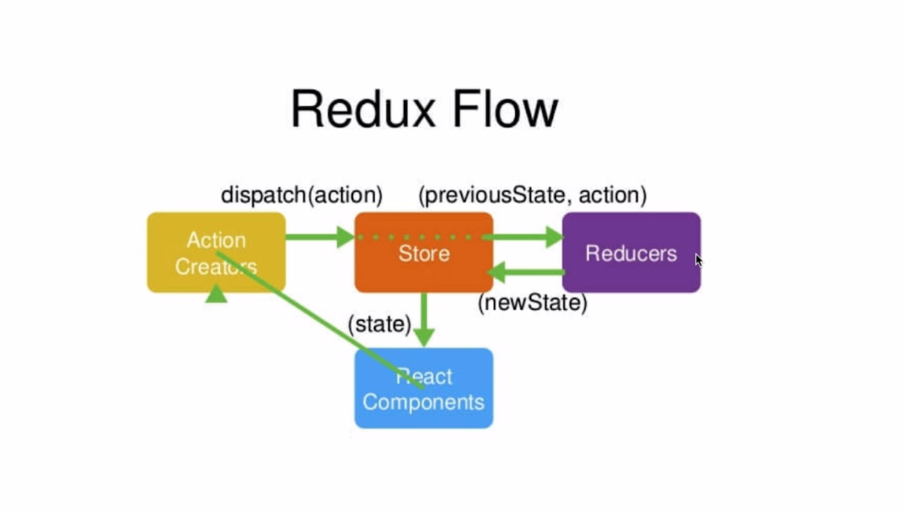

# redux
Redux中，可以把数据先放在数据仓库（store-公用状态存储空间）中，这里可以统一管理状态，然后哪个组件用到了，就去stroe中查找状态。如果途中的紫色组件想改变状态时，只需要改变store中的状态，然后其他组件就会跟着中的自动进行改变。

## Flux和Redux的关系

Redux就是Flux的升级版本，早期使用React都要配合Flux进行状态管理，但是在使用中，Flux显露了很多弊端，比如多状态管理的复杂和易错。所以Redux就诞生了，现在已经完全取代了Flux


## 调试
安装谷歌插件  Redux DevTools

配置Redux Dev Tools
```javascript
import { createStore } from 'redux'  //  引入createStore方法
import reducer from './reducer'    
const store = createStore(reducer,
window.__REDUX_DEVTOOLS_EXTENSION__ && window.__REDUX_DEVTOOLS_EXTENSION__()) // 创建数据存储仓库
export default store   //暴露出去
```
`window.__REDUX_DEVTOOLS_EXTENSION__ && window.__REDUX_DEVTOOLS_EXTENSION__()`
这句话的意思就是看window里有没有这个方法

## redux官方图片




### Redux的流程如下
#### 1. 创建store，reduce
在src下建一个store文件夹
```
src
———— store
    ——index.js // 就是整个项目的store文件
    ——reducer.js // 一个有管理能力的模块 这就是Reducers
    ——actionCreators.js
      actionType.js
```
组件获得store中的数据
```javascript
import store from './store'
constructor(props){
    super(props)
    console.log(store.getState())
}
```

#### 2. 创建Action 改变store里面的state就要使用action
action 是要通过 dispatch()方法传递给store
```javascript
changeInputValue(e){
    const action ={
        type:'changeInput',
        value:e.target.value
    }
    store.dispatch(action)
}
```

#### 3. reducer中处理action传递的状态

store只是一个仓库，它并没有管理能力，它会把接收到的action自动转发给Reducer，

Reducer可以拿到了原来的数据和新传递过来的数据，现在要作的就是改变store里的值。我们先判断type是不是正确的，如果正确，我们需要从新声明一个变量newState。（记住：Reducer里只能接收state，不能改变state。）,所以我们声明了一个新变量，然后再次用return返回回去。
```javascript
export default (state = defaultState,action)=>{
    if(action.type === 'changeInput'){
        let newState = JSON.parse(JSON.stringify(state)) //深度拷贝state
        newState.inputValue = action.value
        return newState
    }
    return state
}
```
#### 4. store数据更改之后让组件视图进行更新

在组件文件中的constructor，写入下面的代码。
```javascript

constructor(props){
    super(props)
    this.state=store.getState();
    this.changeInputValue= this.changeInputValue.bind(this)
    //----------关键代码-----------start
    this.storeChange = this.storeChange.bind(this)  //转变this指向
    store.subscribe(this.storeChange) //订阅Redux的状态
    //----------关键代码-----------end
}

// 重新设置state的值
storeChange=()=>{
    this.setState(store.getState())
  }
```

# 案例 使用redux制作todoList
## 工作中写Redux的小技巧-1
- 把Action Types 单度写入一个文件
写Redux Action的时候，我们写了很多Action的派发，产生了很多Action Types，如果需要Action的地方我们就自己命名一个Type,会出现两个基本问题：

这些Types如果不统一管理，不利于大型项目的服用，设置会长生冗余代码。
因为Action里的Type，一定要和Reducer里的type一一对应在，所以这部分代码或字母写错后，浏览器里并没有明确的报错，这给调试带来了极大的困难。
那我司中会把Action Type单独拆分出一个文件。在src/store文件夹下面，新建立一个actionTypes.js文件，然后把Type集中放到文件中进行管理。

```javascript
export const  CHANGE_INPUT = 'changeInput'
export const  ADD_ITEM = 'addItem'
export const  DELETE_ITEM = 'deleteItem'
```

引入Reducer并进行更改 和引入 组件
- 工作中写Redux的小技巧-2
编写actionCreators.js文件

action 的提取

## Redux填三个小坑
- store必须是唯一的，多个store是坚决不允许，只能有一个store空间
- 只有store能改变自己的内容，Reducer不能改变
- Reducer必须是纯函数

## 组件UI和业务逻辑的拆分方法


## 填坑和Redux中的无状态组件
无状态组件提升性能
无状态组件其实就是一个函数，它不用再继承任何的类（class），当然如名字所一样，也不存在state（状态）。因为无状态组件其实就是一个函数（方法）,所以它的性能也比普通的React组件要好。

把UI组件改成无状态组件可以提高程序性能，具体来看一下如何编写。

首先我们不在需要引入React中的{ Component }，删除就好。
然后些一个TodoListUI函数,里边只返回JSX的部分就好，这步可以复制。
函数传递一个props参数，之后修改里边的所有props，去掉this。

## Axios异步获取数据并和Redux结合

## Redux-thunk中间件的安装和配置

npm install --save redux-thunk

1. 引入applyMiddleware,如果你要使用中间件，就必须在redux中引入applyMiddleware.

import { createStore , applyMiddleware } from 'redux' 
2. 引入redux-thunk库

import thunk from 'redux-thunk'
如果你按照官方文档来写，你直接把thunk放到createStore里的第二个参数就可以了，但以前我们配置了Redux Dev Tools，已经占用了第二个参数。

官方文档给的方法:

const store = createStore(
    reducer,
    applyMiddleware(thunk)
) // 创建数据存储仓库
这样写是完全没有问题的，但是我们的Redux Dev Tools插件就不能使用了，如果想两个同时使用，需要使用增强函数。使用增加函数前需要先引入compose。

import { createStore , applyMiddleware ,compose } from 'redux' 
然后利用compose创造一个增强函数，就相当于建立了一个链式函数，代码如下:

```javascript
const composeEnhancers =   window.__REDUX_DEVTOOLS_EXTENSION_COMPOSE__ ?
    window.__REDUX_DEVTOOLS_EXTENSION_COMPOSE__({}):compose
```
有了增强函数后，就可以把thunk加入进来了，这样两个函数就都会执行了。

```
const enhancer = composeEnhancers(applyMiddleware(thunk))
```
这时候直接在createStore函数中的第二个参数，使用这个enhancer变量就可以了，相当于两个函数都执行了。

```
const store = createStore( reducer, enhancer) // 创建数据存储仓库
```

```javascript
import { createStore , applyMiddleware ,compose } from 'redux'  //  引入createStore方法
import reducer from './reducer'    
import thunk from 'redux-thunk'

const composeEnhancers =   window.__REDUX_DEVTOOLS_EXTENSION_COMPOSE__ ?
    window.__REDUX_DEVTOOLS_EXTENSION_COMPOSE__({}):compose

const enhancer = composeEnhancers(applyMiddleware(thunk))

const store = createStore( reducer, enhancer) // 创建数据存储仓库
export default store   //暴露出去
```
这样就算把Redux的中间件配置好了，可以运行项目，到浏览器看一下结果和看一下Redux Dev Tools插件了。

## Redux-thunk的使用方法
把向后台请求数据的程序放到中间件中，这样就形成了一套完整的Redux流程，所有逻辑都是在Redux的内部完成的，这样看起来更完美，而且这样作自动化测试也会变动简单很多，所以工作中你还是要尽量按照这种写法来写
```javascript
export const getTodoList=()=>{
  return (dispatch)=>{
    axios.get('https://www.easy-mock.com/mock/5d4a953c382a052ea435900a/example/query').then(res=>{
    
      if(res.data.success){
        
        const action=getListAction(res.data.data.list)
        dispatch(action)
      }
    })
  }
}
```

## Redux-saga的安装和配置
Redux-saga 是redux的一个中间件   Redux-thunk也是redux的中间件


# 使用React-Redux

React-Redux 是依赖于redux的
## 安装和配置
```javascript
npm install --save redux
npm install --save react-redux
```

## React-redux中的Provider和connect

#### connect连接器的使用

### 22React-redux的数据修改